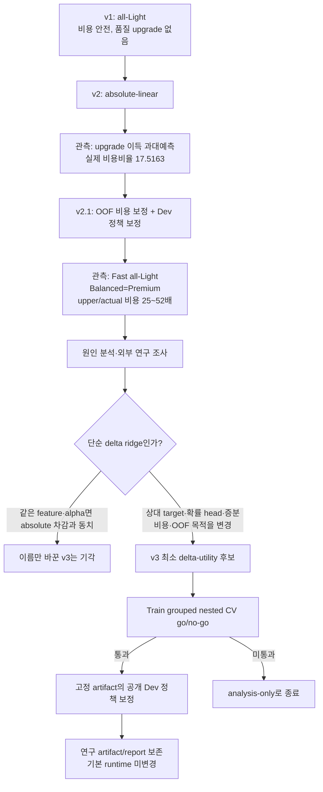
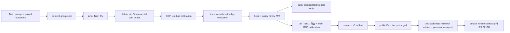

<!--
SPDX-FileCopyrightText: Copyright 2026 SK TELECOM CO., LTD.
SPDX-License-Identifier: Apache-2.0
-->

# PromptBudget v3 Delta-Utility Router 설계서

**상태:** 방향 승인 · 문서 검토 대기 — 구현 전

**결정일:** 2026-08-25

**코드 기준:** 로컬 `main`의 v2.1 기준 merge commit `8ec1789`

**범위:** v3는 연구용 `delta-linear` artifact 후보를 만드는 최소 변경이다. v2.1
artifact, report 및 기본 runtime artifact는 보존하며, hidden 성능·예산 통과·배포
승격을 주장하지 않는다.

## 1. 요약

v2.1은 prompt-only Train→공개 Dev 정책 보정 파이프라인을 안전하게 만들었지만,
모델별 **절대 품질**을 예측한 뒤 차감해 업그레이드를 결정했다. 이 방식은 Light보다
실제로 좋아질 확률을 크게 과대평가했고, 비용 상한도 실제 비용보다 25~52배 크게
나왔다.

v3는 Light를 기준선으로 고정하고, 업그레이드 모델 `m ∈ {ax31, axk1-think}`마다
다음을 별도로 다룬다.

| 신호 | 정의 | 정책에서의 역할 |
| --- | --- | --- |
| `delta_quality[m]` | `quality(m) − quality(Light)` | 얼마나 좋아질지 |
| `p_win[m]` | `P(delta_quality[m] > 0)` | 올릴 가치가 있을 확률 gate |
| `incremental_relative_cost[m]` | `(cost(m) − cost(Light)) / cost(Light)` | Light 대비 추가 예산 위험 |

그러므로 v3의 기본 원칙은 “가장 품질이 높아 보이는 모델”이 아니라 **Light보다
유의미하게 좋아질 가능성이 있고, 추가 비용 위험이 tier에 맞는 모델만 선택**하는
것이다.

## 2. 문제에서 결정까지의 흐름



### 2.1 문제와 관측

| 문제 | v2/v2.1 근거 | 영향 |
| --- | --- | --- |
| 상대 품질 이득 과대예측 | Dev 실제 양의 이득률은 ax31 17.95%, Think 29.77%인데 v2 예측은 각각 94.89%, 97.73% | 대부분의 요청을 가치 없는 upgrade로 오판할 위험 |
| 절대 비용 상한 과대 | v2.1 Dev의 predicted-upper/actual은 Fast 약 46.45, Balanced/Premium 약 52.32 | upper 비용이 runtime 효용·상대비 gate를 왜곡할 위험 |
| tier 분별력 부재 | Balanced와 Premium이 같은 설정·같은 route로 수렴 | Premium 추가 예산을 쓸 근거를 찾지 못함 |
| 목적 함수 불일치 | v2 OOF raw-MSE에서 token 항이 91.68% | 공식 점수의 품질·예산 목적과 학습 선택 기준이 어긋남 |

### 2.2 확인된 원인

1. **절대 target과 결정 target의 차이** — 모델별 품질 회귀 오차를 빼면 두 오차가
   결합된다. 낮은 absolute MSE가 정확한 `Light 대비 이득` 판별을 보장하지 않는다.
2. **비용의 잘못된 단위** — 총비용 예측에 큰 one-sided p99 배수를 곱하면, Light와
   공유하는 입력비용과 서로 상관된 길이 오차도 함께 부풀린다.
3. **정책/안전 지표의 불일치** — Train은 predicted-relative cost, Dev는 actual cost로
   후보를 판정했다. 두 값은 같은 안전 주장이 아니다.
4. **`lambda=0` 정책 붕괴** — 비용이 효용에서 사라지고 common safety multiplier가
   상대비에서 상쇄되면 Balanced/Premium이 같은 품질 최대화 route로 수렴할 수 있다.

### 2.3 검토한 선택지와 결정

| 선택지 | 장점 | 기각 또는 채택 이유 |
| --- | --- | --- |
| 비용 보정만 바꾸는 v2.2 | 구현 범위가 작음 | 품질 이득 과대예측을 해결하지 못해 기각 |
| 같은 feature/alpha의 delta ridge | 코드 변화가 작음 | absolute head 차감과 선형적으로 동치라 기각 |
| end-to-end router, 외부 embedding, formal CRC | 잠재적으로 강력함 | 공개 데이터 규모·실행 제약·검증 시간 대비 과도해 기각 |
| **최소 delta-utility v3** | 결정 target에 맞고 runtime 제약을 유지 | **채택** |

## 3. 목표와 비목표

### 목표

1. Light 대비 품질 이득, 양의 이득 확률, 추가 비용을 직접 예측하는 prompt-only
   router family를 정의한다.
2. Train grouped nested CV에서 v2.1보다 나은 정책 수준의 증거가 있을 때만 Dev
   정책 보정 단계로 진행한다.
3. 비용 upper의 실제 coverage와 과보수성(slack)을 보고해, 예산 리스크를 숨기지
   않는다.
4. Fast/Balanced/Premium의 비용·품질 경계를 관찰 가능하게 만든다. tier가 같아지는
   것은 금지하지 않지만, 진단상 정책 붕괴로 기록한다.

### 비목표

- hidden split 예산 통과 또는 외부 일반화 보장
- runtime에서 모델 호출, 답변 비교, 재시도, 순차 escalation
- `episode_id`, split, 순서, 출처, 실제 outcome/비용을 runtime feature로 사용
- 대형 외부 embedding 모델·네트워크 의존성·새 배포 artifact의 기본 설치
- v3를 formal conformal 또는 99% 보장 시스템으로 홍보

## 4. 데이터 경계와 책임

| 단계 | 사용 가능한 정보 | 허용된 책임 | 금지 |
| --- | --- | --- | --- |
| Train | prompt, 세 모델 score/token/cost, 정책 | head·feature·calibration·policy family의 nested CV 선택 | outer-test를 최종 선택에 재사용 |
| Train outer test | Train에서 분리된 content group | 보고 전용 비교·bootstrap CI | 후보/threshold 선택 |
| 공개 Dev | prompt, score/token/cost, 정책 | Train-frozen v3 artifact의 tier policy 반복 보정 | runtime feature·head 구조의 반복 변경 |
| runtime/hidden | prompt, tier, 동결 artifact, 동결 정책 | 모델 ID 하나 선택 | outcome, 실제 비용, ID/split/순서/출처, 네트워크/API |

동일한 `prompt + tier`는 입력 ID·순서가 달라도 동일한 model ID를 내야 한다.

## 5. v3 모델과 정책

### 5.1 Train target

각 Train 문항 `x`와 upgrade 모델 `m`에 대해 공개 정책의 실제 비용식을 사용해 다음
paired target을 만든다.

```text
delta_quality_m(x) = score_m(x) - score_light(x)
win_m(x)           = 1[delta_quality_m(x) > 0]
delta_cost_m(x)    = cost_m(x) - cost_light(x)
relative_cost_m(x) = delta_cost_m(x) / cost_light(x)
```

`relative_cost_m`이 runtime 정책의 기본 비용 target이다. 이는 공식 예산도 전체
Light baseline 대비 상대비로 계산하기 때문이다. `delta_cost_m`은 해석과 금액 단위
오류 분석을 위해 같이 report한다.

### 5.2 Head family

각 upgrade 모델에 대해 서로 분리된 다음 세 head를 fit한다.

| Head | 출력 | 최소 구현 | v2.1과 달라지는 점 |
| --- | --- | --- | --- |
| delta-quality | `E[delta_quality]` | ridge regression | delta target별 sparse feature 선택과 alpha 선택 |
| win-probability | `P(delta_quality > 0)` | deterministic logistic regression 또는 동등한 확률 선형 모델 | 이득 크기와 이득 가능성을 분리 |
| incremental-cost | `E[relative_cost]` 및 residual | ridge + one-sided residual calibration | 총 token 비용 조합 대신 paired relative cost를 직접 학습 |

각 head는 같은 feature space를 재사용할 수 있지만, feature 수와 regularization은
target별 후보 grid에서 독립적으로 고른다. 이 독립 선택이 “absolute head 차이를
다시 계산하는 것”과의 핵심 차이다.

### 5.3 비용 upper

비용 head가 예측한 relative incremental cost를 `r_hat`이라 하고, Train cross-fit
residual에서 선택한 단측 분위수 보정을 `u`라 한다.

```text
r_upper = max(0, r_hat + u)
```

- 후보 분위수는 `0.90`, `0.95`, `0.99`로 고정하고 Train inner CV에서 선택한다.
- `u`는 model·prompt-length bucket별로 계산하되, bucket이 100개 미만이면 해당
  model의 global residual로 fallback한다.
- 이 값은 **empirical upper**다. independent calibration split 또는 적절한
  cross-conformal 절차 없이 finite-sample 99% 보장이라고 표현하지 않는다.
- 보고서는 전체·모델·길이 bucket·선택된 upgrade 조건별 empirical coverage와
  binomial confidence interval, slack 분포를 모두 기록한다.

### 5.4 Runtime 선택 규칙

Light는 항상 후보에 포함한다. upgrade 모델은 아래 네 조건을 동시에 통과할 때만
후보가 된다.

```text
p_win_m              >= tier.min_win_probability
delta_quality_hat_m  >= tier.min_delta_gain
1 + r_upper_m        <= tier.max_relative_cost
delta_utility_m      = delta_quality_hat_m - tier.lambda_cost * r_upper_m > 0
```

통과 후보 중 `delta_utility`가 가장 큰 모델을 고른다. 동점은 더 낮은 `r_upper`, 그
다음 정책의 모델 순서로 결정한다. 아무 upgrade도 통과하지 않으면 Light를 선택한다.

`lambda_cost`, `min_win_probability`, `min_delta_gain`, `max_relative_cost`,
residual quantile은 정책 knob다. Train에서는 사전 등록된 후보 grid를 nested CV로
비교하고, Dev에서는 Train-frozen family의 tier knob만 보정한다.

## 6. 학습·보정·평가 흐름



### 6.1 Train 선택 규칙

1. content-group 기반 3 seed × 5 outer fold를 유지한다.
2. 각 outer-train에서 inner grouped fold로 head별 feature/alpha, residual quantile,
   policy family를 고른다.
3. inner candidate의 공식 tier 점수는 **실제 inner-validation cost**로 판정한다.
   predicted risk는 후보 선택의 보조 진단·동점 규칙에만 사용하며, actual-cost 판정을
   대체하지 않는다.
4. outer-test는 선택에 되돌려 쓰지 않고 v2.1 대비 report-only 결과를 만든다.
5. 최종 후보는 모든 Train으로 refit하되, 비용 보정은 final head와의 관계를 명시한
   cross-fit residual로 수행한다.

### 6.2 Dev 정책 보정

공개 Dev의 반복 정책 보정은 공식 과제에서 허용된다. 단, v3 family/head structure,
feature grid, alpha grid, residual quantile grid는 Dev 이전에 Train에서 동결한다.

Dev에서는 실제 공식 비용비율로 tier 예산을 판정한다.

| Tier | Dev admission | 목적 |
| --- | --- | --- |
| Fast | 실제 비용비율 `<= 1.15` | 1.25 한도에서 0.10 여유 유지 |
| Balanced | 실제 비용비율 `< 2.0` | 품질 최대화와 비용 여유 |
| Premium | 실제 비용비율 `< 4.0` | 더 큰 예산에서의 추가 품질 탐색 |

Dev 최고 점수는 제출 후보 선택 근거일 뿐, hidden 성능 또는 일반화의 독립 증거가
아니다.

## 7. Go / No-Go 기준

v3는 아래 조건을 충족할 때만 Dev policy calibration과 후속 구현으로 진행한다.

| 판정 | 조건 |
| --- | --- |
| Go | Train outer grouped evaluation에서 v2.1보다 weighted tier score가 높고, 모든 tier의 actual-cost admission을 통과하며, relative-cost upper의 p90 slack이 v2.1보다 낮음 |
| No-Go | 위 셋 중 하나라도 실패하거나, win-probability가 all-positive baseline보다 upgrade precision을 높이지 못함 |
| 기록만 | Dev에서 더 높은 점수가 나도 Train Go를 통과하지 못하면 v3는 analysis-only로 기록 |

score 차이와 비용-risk 지표에는 content-group bootstrap confidence interval을 같이
기록한다. 신뢰구간이 넓으면 “개선 확인”이 아니라 “불확실”로 표현한다.

## 8. 필수 보고 표

### 8.1 신호 품질

| 모델 | delta MAE | delta rank correlation | win Brier | win AUROC | upgrade precision | upgrade recall |
| --- | ---: | ---: | ---: | ---: | ---: | ---: |
| ax31 |  |  |  |  |  |  |
| axk1-think |  |  |  |  |  |  |

### 8.2 비용 위험

| 모델/길이 | relative-cost MAE | p90 AE | empirical coverage | 95% CI | p50 slack | p90 slack | p99 slack |
| --- | ---: | ---: | ---: | --- | ---: | ---: | ---: |
| ax31 / short |  |  |  |  |  |  |  |
| ax31 / medium |  |  |  |  |  |  |  |
| ax31 / long |  |  |  |  |  |  |  |
| Think / short |  |  |  |  |  |  |  |
| Think / medium |  |  |  |  |  |  |  |
| Think / long |  |  |  |  |  |  |  |

### 8.3 정책 비교

| Candidate | Tier | actual cost ratio | score | upgrade 분포 | win/tie/loss | oracle regret | budget pass |
| --- | --- | ---: | ---: | --- | --- | ---: | --- |
| all-Light | Fast/Balanced/Premium |  |  |  |  |  |  |
| all-ax31 | Fast/Balanced/Premium |  |  |  |  |  |  |
| v2.1 | Fast/Balanced/Premium |  |  |  |  |  |  |
| v3 | Fast/Balanced/Premium |  |  |  |  |  |  |
| budget oracle | Fast/Balanced/Premium |  |  |  |  | 0 |  |

Premium이 Balanced와 동일한 경우에는 그 사실, 남은 비용 여유, Think 선택 수와
추가 quality를 별도 진단으로 기록한다. 같아야 한다거나 달라야 한다는 정책 제약은
두지 않는다.

## 9. Artifact, 호환성, 산출물 경계

| 항목 | v3 요구 |
| --- | --- |
| artifact family | 새 `delta-linear` family. 기존 `absolute-linear` v1/v2 artifact는 읽기 호환 유지 |
| 저장 head | upgrade별 delta-quality, win-probability, incremental-relative-cost, residual calibration, tier settings |
| provenance | Train/Dev input/outcome digest, feature/alpha/quantile grids, selected values, policy digest, report type, artifact SHA-256 |
| output 위치 | `build/promptbudget-v3/` 아래 연구 artifact/report만 생성 |
| default runtime | `src/promptbudget/resources/artifact.json`는 변경 금지 |
| runtime 경로 | 기존 `promptbudget.runtime` 인터페이스와 prompt-only 결정성 유지 |

## 10. 테스트 및 수용 조건

1. paired target 계산은 score/cost 차이와 정책의 `Decimal` 비용식을 정확히 따른다.
2. 동일 feature/alpha의 absolute-difference ridge와 direct delta ridge가 동치임을
   regression test로 고정한다. v3 후보가 독립 feature/alpha 또는 win head를 실제로
   사용할 때만 비동치가 허용된다.
3. runtime은 ID·순서 permutation에서 동일 prompt+tier 선택을 유지한다.
4. upgrade가 p-win, delta gain, relative cost, utility 중 하나라도 실패하면 Light로
   fallback한다.
5. `r_upper`는 음수가 될 수 없고, calibration bucket fallback은 provenance에 기록된다.
6. artifact loader는 malformed probability, non-finite value, 누락된 upgrade head,
   정책/format 불일치를 거부한다.
7. Train/Dev tool은 v3 결과를 오직 `build/promptbudget-v3/` 아래에 쓴다.
8. focused test, data validation, runtime permutation test를 모두 통과하기 전에는
   v3 artifact를 기본 runtime에 설치하지 않는다.

## 11. 남은 의도적 한계

- Train/Dev가 hidden distribution을 대표한다는 보장은 없다.
- 100개 미만 bucket의 global fallback은 conditional coverage를 보장하지 않는다.
- 공개 Dev 반복 보정은 대회 규칙상 허용되지만, Dev score를 독립 일반화 성능으로
  해석할 수 없다.
- batch-level hidden budget 통과는 runtime이 실제 token을 모르므로 확률적 위험이며,
  확정 보장이 아니다.
- formal Conformal Risk Control은 현재 최소 v3의 범위 밖이다. 필요해지면 별도
  design/validation으로 추가한다.

## 12. 레퍼런스와 근거 로그

아래 자료는 2026-08-25에 확인했다. 공식 규칙은 연구 논문보다 우선한다.

| 출처 | 성격 | 이 설계에 사용한 근거 | 한계 |
| --- | --- | --- | --- |
| [SKT Efficient LLM Routing Challenge 공식 저장소](https://github.com/sktelecom/ossp-2026-llm-router-challenge) | 공식 규칙 | prompt-only, 한 번의 모델 선택, Train/Dev 활용, strict tier budget, runtime 제약 | 방법론의 성능을 증명하지 않음 |
| [v2.1 구현 인수인계서](../../skt/2026-08-25-promptbudget-v2.1-implementation-handoff.md) | 내부 재현 기록 | 실패 수치, artifact 경계, Train/Dev 역할 | hidden 일반화 증거가 아님 |
| [PromptBudget v2 운영 절차](../../PROMPTBUDGET_V2_OPERATIONS.md) | 내부 운영 규격 | Dev 반복 policy calibration과 runtime 금지 정보 | v3의 새 target을 정의하지 않음 |
| [RouteLLM (ICLR 2025)](https://proceedings.iclr.cc/paper_files/paper/2025/file/5503a7c69d48a2f86fc00b3dc09de686-Paper-Conference.pdf) | 동료심사 연구 | pairwise win/preference를 직접 학습하는 routing 근거 | 두 모델 중심, 비용 uncertainty를 해결하지 않음 |
| [CARROT (2025)](https://arxiv.org/abs/2502.03261) | preprint/workshop 연구 | 품질·비용 trade-off를 prompt별로 다루는 근거 | prompt-only token-risk 보정의 보장은 아님 |
| [Causal LLM Routing (NeurIPS 2025)](https://proceedings.neurips.cc/paper_files/paper/2025/hash/357774d53e5ee21c5f08ba779e3b5dd9-Abstract-Conference.html) | 동료심사 연구 | 분리된 metric 예측의 오차 결합과 regret 관점 | observational-feedback 문제라 full-feedback Train과 다름 |
| [LLMRouterBench (Findings ACL 2026)](https://aclanthology.org/2026.findings-acl.1881.pdf) | 동료심사 benchmark | 복잡한 router가 단순 baseline을 항상 이기지 않으므로 강한 비교·go/no-go가 필요 | 이 과제의 모델·점수·비용 정책과 다름 |
| [Conformalized Quantile Regression (NeurIPS 2019)](https://proceedings.neurips.cc/paper/2019/hash/5103c3584b063c431bd1268e9b5e76fb-Abstract.html) | 동료심사 연구 | 이분산 비용 오차에 대한 conditional quantile + residual 보정의 근거 | 개별 prompt conditional coverage를 보장하지 않음 |
| [Uncertainty-Aware CQR (AISTATS 2024)](https://proceedings.mlr.press/v238/rossellini24a.html) | 동료심사 연구 | 전역 보정보다 input-dependent uncertainty를 평가할 근거 | 이 과제에서의 성능을 보장하지 않음 |
| [Limits of Distribution-Free Conditional Predictive Inference](https://www.stat.berkeley.edu/~ryantibs/papers/limits.pdf) | 이론 연구 | “bucket별/개별 99% 보장”을 과도하게 주장하지 않아야 하는 근거 | 실무적 정책 선택 규칙을 제공하지 않음 |

## 13. 다음 단계

이 문서를 검토·승인한 뒤에만 별도 구현 계획을 만든다. 구현 계획은 TDD 순서로
paired target/metrics, artifact schema, runtime selection, Train selection, Dev calibration,
reporting, focused verification을 분리한다.
